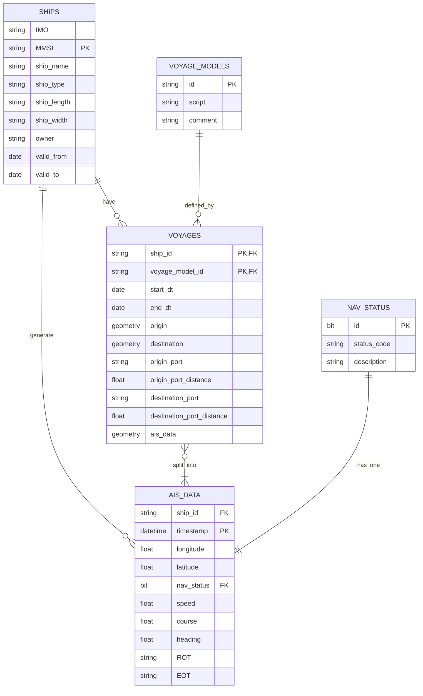

# CLEAR: data management

## Setup database
- install [docker engine](https://docs.docker.com/engine/install/ubuntu/) or [docker desktop](https://docs.docker.com/desktop/)
- install [docker-compose]()
- Run `docker-compose -f docker-compose.db.yml up -d`
- Stop every container `docker-compose -f docker-compose.db.yml down`

 
> Web interfaces from docker:

Click on the links to open the locally served web pages
- [Martin tileserver](http://localhost:8090/catalog)
- [pg_admin db management](http://localhost:5050)
- [PostgREST API](http://localhost:8080)
- [Swagger postgREST API docs](http://localhost:8070)

## Install python environment: 

- linux/mac:
    - python3 -m venv clear_venv && source clear_venv/bin/activate
    - pip install  -r requirements.txt

- windows:
    - python3 -m venv clear_venv
    - clear_venv\Scripts\activate
    - pip install  -r requirements.txt

## Load data into database
- Start the local db container `docker-compose -f docker-compose.db.yml up -d`
- To insert data into database: Run `python3 src/insert_ais_data.py --datapath path/to/csv_files`

## Compute voyage segments
- Run `python3 src/compute_voyage_segments.py`

### marp
- present on browser: PORT=5340 marp -s docs

### DB Schema

