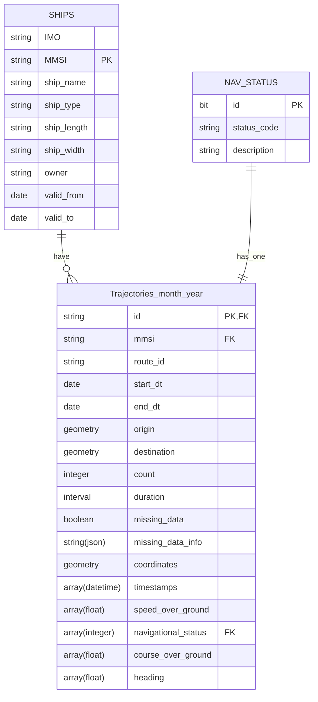

# CLEAR: data management

## Setup database
- install [docker engine](https://docs.docker.com/engine/install/ubuntu/) or [docker desktop](https://docs.docker.com/desktop/)
- install [docker-compose]()
- cd to database directory
- To run all containers use `docker-compose -f docker-compose.db.yml up -d`
- To Stop every container `docker-compose -f docker-compose.db.yml down`
- The containers need to be up and running for the database to work.
- Use [pg_admin db management](http://localhost:5050) to monitor the database

## DB credentials .env file
- Need to change them in .env file before launching the docker-compose containers.
- postgis db credentials (current default):  

    ```
    POSTGRES_DB=gis                            
    POSTGRES_USER=clear
    POSTGRES_PASSWORD=clear
    POSTGRES_PORT=5432
    ```
- pgadmin login default credentials:

    ```
    PGADMIN_DEFAULT_EMAIL=admin@admin.com
    PGADMIN_DEFAULT_PASSWORD=admin
    ```


## Change where the database is stored
- use `POSTGRES_DATA_DIR=./data/nas/psql_data` in .env file before launching the docker-compose containers.
- local folder path example: `./psql_data`
- on NAS: `./data/nas/psql_data` (after mounting NAS to this folder)

## How to mount NAS on Linux / Mac
> NAS info:

```
IP: 172.25.113.94
mac address: 90:09:D0:65:9B:C5
```

```
device: ClearNAS
admin: clear_admin
pass: TT5N3c8u6L
```

Example commands:
```bash
sudo mount -v -t cifs //172.25.113.94/ClearData /mnt/nas -osec=ntlmv2,username=clear_admin,password=TT5N3c8u6L,domain=ClearNAS,vers=3.0
```

```bash
sudo mount -v -t cifs //172.25.113.94/ClearData ./data/nas -o sec=ntlmv2,username=clear_admin,password=TT5N3c8u6L,domain=ClearNAS,vers=3.0,uid=999,file_mode=0750,dir_mode=0750
```

 
## Install python environment: 

- linux/mac:
    ```bash
    python3 -m venv clear_venv && source clear_venv/bin/activate
    pip install  -r requirements.txt
    ```
- windows:
    ```
    - python3 -m venv clear_venv
    - clear_venv\Scripts\activate
    - pip install  -r requirements.txt
    ```

## For new CSV file, use column names merging
- To update the csv to db mapping: `python3 src/update_mapping.py`

## Insert BatchMode: Compute trajectories and load them into database on a folder of raw AIS data csv files)
- Make sure the python environemnt is active and db / docker containers  are running
- To insert data into database one instance: `python3 src/ais_data_processor.py --datapath path/to/csv_files`
- Insert data in Parallel: `bash run.sh`

## Insert csv file: Compute trajectories and load them into database (single AIS data csv file)
- Make sure the python environemnt is active and db / docker containers  are running
- To insert data into database one instance: `python3 src/ais_data_processor.py --datapath path/to/csv_file`

## How to split database into years or any other way
1) change the path to db staorage for example from  `POSTGRES_DATA_DIR=./psql_data` to `POSTGRES_DATA_DIR=./psql_data_2025` in .env file
2) change database name for example from `POSTGRES_DB=gis`to `POSTGRES_DB=ais_2025`, postgress can have multiple databases.
Inorder to be able to move the db data and use it in another location, use Option 1
Other options like pg_basebackup and rsync exist but they are more complicated to manage and sync.

# save db into .sql file
```bash
docker run --rm \
  -e PGPASSWORD='POSTGRES_PASSWORD' \
  -v $PWD:/backups \
  postgres:16 \
  pg_dump -h host.docker.internal -U POSTGRES_USER POSTGRES_DB > ./data/dump.sql
```

example with default db credentials:
```bash
docker run --rm \
  -e PGPASSWORD='clear' \
  -v $PWD:/backups \
  postgres:16 \
  pg_dump -h host.docker.internal -U clear gis > ./dump.sql
```

## load saved db in .sql file format to a new database

```bash
docker run --rm \
  -e PGPASSWORD="$DB_PASSWORD" \
  -v "$PWD":/backups \
  postgres:16 \
  psql -h host.docker.internal -U "POSTGRES_USER" -d "POSTGRES_DB" -f "./data/dump.sql"
```

## Example queries:
- check for intersection of two linestring trajectories
- distance between trajectories
- distance between trajectory and coastline
- get trajectories with a bounding box
- more ideas?


## Create new tables


## add new sources of data:

### Natural earth data

### OSM data


### marp
npm i -g @marp-team/marp-cli
- present on browser: PORT=5340 marp --html -s docs

### DB Schema



