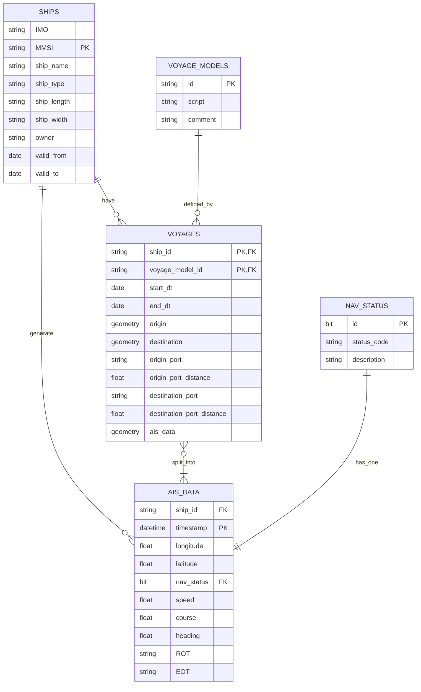

# CLEAR: data management

## Install: 

- linux/mac:
    - python3 -m venv clear_venv && source clear_venv/bin/activate
    - pip install  -r requirements.txt

- windows:
    - python3 -m venv clear_venv
    - clear_venv\Scripts\activate
    - pip install  -r requirements.txt

### marp
- present on browser: PORT=5340 marp -s docs

### DB Schema

### Notes:

- Define types of voyages:
    - full length: origin port to destination port
    - only_when_moving
    - estimated missing trajectories

#### Questions:
- Should these be in the AIS_data / voyages? 
speed, course, heading, ROT, destination, EOT
- Commmon DB schema standards?

