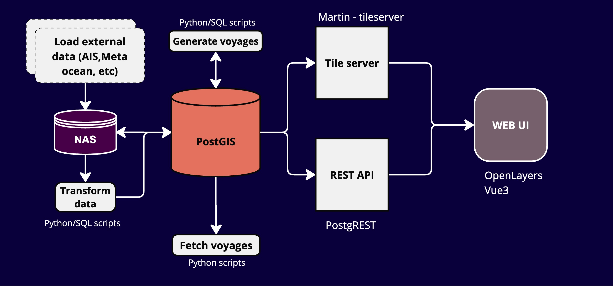
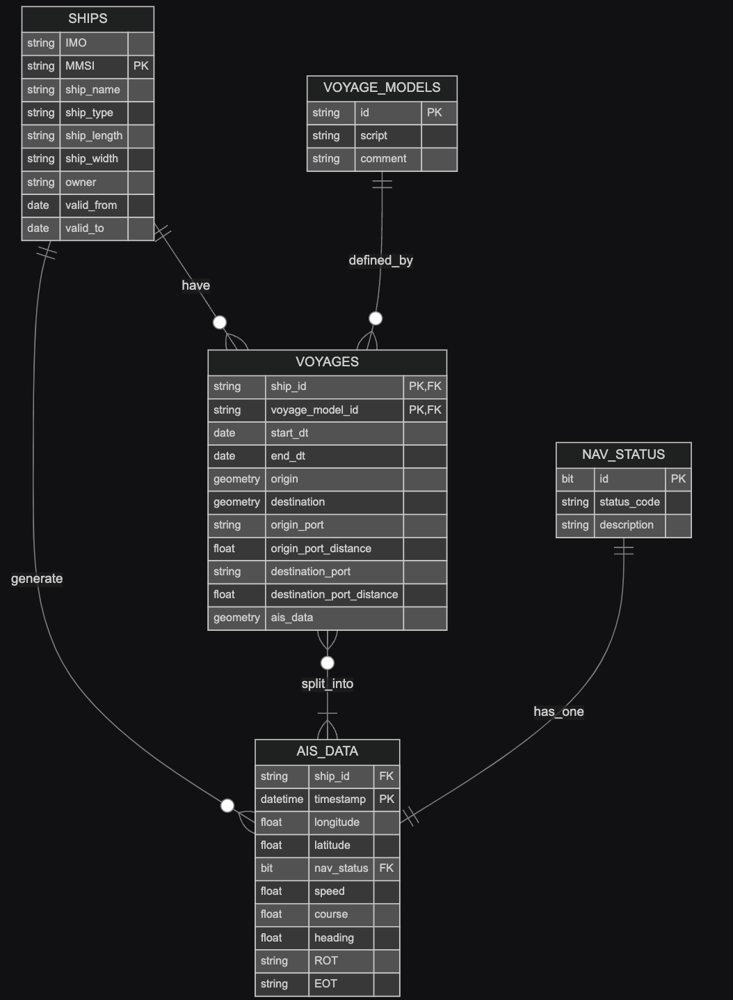
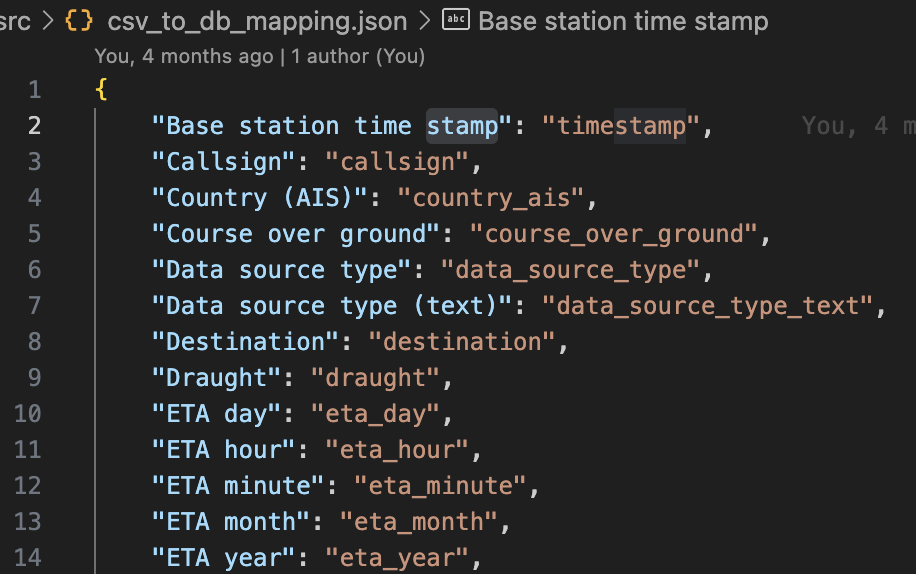
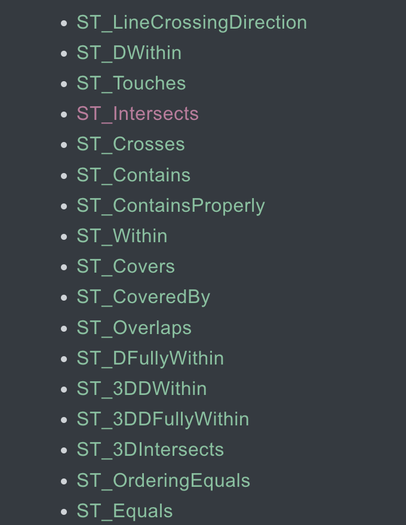

# 🚢 CLEAR Database & Visualization

<!-- ---

# 🌟 Overview

- **Database Schema Design**
- **Data sources**
- **Views and Queries**
- **Frontend Integration**
- **Visualization with OpenLayers** -->

---

## 🛠️  Database

---

## ✨ Database architechture and Frontend Integration 



---
### Tables Overview

- **`ships` Table**: Stores ship details like MMSI, IMO, and dimensions.
- **`ais_data` Table**: Holds AIS data with timestamps, positions, speed, and navigation status.
- **`voyage_segments` Table**: Stores segmented voyage data with origin `POINT`, destination `POINT`, and `LINESTRING` AIS_data.

---
# Schema


---

# 🌐 Data Sources

- AIS data 
- [OSM](https://download.openstreetmap.fr/extracts/)
- [Natural earth](https://www.naturalearthdata.com/downloads/)

#### OSM data from [openseamaps](https://www.openseamap.org/index.php?id=openseamap&no_cache=1)

---
## Mapping new data to Database



---
# Additional data sources

- Metaocean data
- Ship meta data from ships database dowload or API?

---

# 💾 Diskspace

### AIS data

Decompressed data: 307 GB

table: 101 GB
index: 29 GB
total: 130 GB

---

## 🎤 Status update

---
## 🔗 Connecting to database and NAS

1) NAS is configured at CIT  

2) All the data / database storage is on NAS right now

3) Database is up and running using the data on the NAS

4) Acces to DB provided for Leon via VPN and python scripts.

---
# QGIS


---
# Front end visualization: 

+ QGIS
+ Martin tile server + vue openlayers
+ Leon's 

+ what brings value? 
(not just nice to have visualization

---
# Next steps: 
+ Provide public/internet access to db
+ introduce static and dynamic obstacles layers
+ add in meta ocean data: waves, winds etc as vector tiles
+ Develop Method to verify voyages / voyage segments.


---
## Querrying
- bounding box query on the tables with regular lat lon takes more than 10 - 20 min
- if the table is big it might be even more!

#### So, how to make the query run faster?

---
### Spacial index on the geometry 
- Geometry type (POINT or LINESTRING)
- Use bounding box method `ST_MakeEnvelope` to select data
```sql
CREATE INDEX idx_ais_data_geom ON ais_data_geom USING GIST (lonlat);

SELECT *
FROM ais_data_geom
WHERE lonlat && ST_MakeEnvelope(12, 57, 12, 57.6, 4326);
```
---
### More ST methods


---
### Spacial Indexing methods: 
- GIST: generalized search tree
    - uses R-tree 
    - works well when there is overlap but quite slow to create
- SPGIST: space partitioned GIST
    - uses variation of kd/quad-tree 
    - works well when there is NO overlap
- BRIN: Block Range Index
    - uses physical blocks of data in db

---
<!-- .slide: style="background-color: #f5f5f5;" -->
### R-tree
+ seperates part of the data using rectangular bounding boxes


---
### kd-tree
+ seperates all the data using planes.


---

### Comparision

<div style="width: 70%; font-size: 18px; margin: auto;"> 

| **Feature**           | **GiST**                                     | **SP-GiST**                                   | **BRIN**                                        |
|-----------------------|----------------------------------------------|-----------------------------------------------|-------------------------------------------------|
| **`Index Granularity`**     | Row-level                                    | Row-level with space partitioning             | Block-level (summary for ranges of rows)        |
| **`Best For `**             | General-purpose spatial queries              | Uniformly distributed point data               | Very large, naturally ordered datasets          |
| **`Index Size `**           | Larger                                       | Often smaller                                  | Very small      
| **`Build Time`**            | Moderate                                     | Moderate                                       | Very fast                                       |
| **`Query Precision `**      | High (fine-grained filtering)                | High for specific patterns                     | Coarse; may yield false positives               |
| **`Maintenance Overhead`**  | Higher (more frequent updates/rebalancing)   | Moderate                                       | Minimal                                         |

</div>

---
### What if the table is too big?
1) Pre-partition the table based on regions or date ranges
    - different table for different regions / time-frames
    - and also use SP-GIST indexing on sub-tables
2) Clustering the table using spacial index 
    - using `CLUSTER`[command](https://postgis.net/workshops/postgis-intro/clusterindex.html) 
3) Query planning and caching
4) Creating views for pre-filtering and aggregating data.
5) data compression

--- 
## Data compression 
- Top-Down Kinematic Compression (TDKC) vs Douglas–Peucker (DP) algorithm

- Should the data be compressed before inserting into the database?

- is python good enough or should we use c or go or someother libraries for preformance?


---

#  Thank you for your time 🐳


---

# More technical details....
---

# 🗺️ Vector tiles with OpenLayers and Vue3

```js
const martinUrlVoyageSegments = "http://0.0.0.0:8090/long_voyages/{z}/{x}/{y}"

 <ol-vector-tile-layer
  ref="MartinLayer5"
  title="voyages"
  >
    <ol-source-vector-tile :url="martinUrlVoyageSegments" :format="mvtFormat">
    </ol-source-vector-tile>
</ol-vector-tile-layer>

```

---

# 🧩 Views and Queries

- full length: origin port to destination port
- Sailing / when the enginge is on
- estimated missing trajectories
- Multiple resolutions (1min, 5min, 30min, 1hr etc.)
- Get ais_data for each voyage

---

##  Voyage splits based on sailing and nav status

```sql
WITH voyage_data AS (
    SELECT
        ship_id,
        timestamp AS point_time,
        ST_SetSRID(ST_MakePoint(lon, lat), 4326) AS point_geom,
        nav_status,
        LEAD(timestamp) OVER (PARTITION BY ship_id ORDER BY timestamp) AS next_time,
        LEAD(nav_status) OVER (PARTITION BY ship_id ORDER BY timestamp) AS next_status
    FROM
        ais_data
	WHERE speed < 0.3
),
segments AS (
    SELECT
        ship_id,
        point_time AS start_dt,
        next_time AS end_dt,
        point_geom AS origin,
        LEAD(point_geom) OVER (PARTITION BY ship_id ORDER BY point_time) AS destination,
        ST_MakeLine(point_geom, LEAD(point_geom) OVER (PARTITION BY ship_id ORDER BY point_time)) AS ais_data
    FROM
        voyage_data
    WHERE
        nav_status in (1,3) 
        AND next_status not in (1,3)
)
INSERT INTO voyage_segments (ship_id, start_dt, end_dt, origin, destination, ais_data)
SELECT
    ship_id,
    start_dt,
    end_dt,
    origin,
    destination,
    ais_data
FROM
    segments
WHERE
    origin IS NOT NULL
    AND destination IS NOT NULL;

```
---
##  Aggregating AIS Data for Voyages

- Create `LINESTRING` from AIS data points for each voyage.

```sql
UPDATE voyage_segments vs
SET ais_data = COALESCE(
    (SELECT ST_MakeLine(ST_SetSRID(ST_MakePoint(ad.lon, ad.lat), 4326) ORDER BY ad.timestamp)
     FROM ais_data ad
     WHERE ad.ship_id = vs.ship_id
       AND ad.timestamp BETWEEN vs.start_dt AND vs.end_dt),
    ST_MakeLine(ARRAY[
      ST_SetSRID(ST_MakePoint(ST_X(vs.origin), ST_Y(vs.origin)), 4326),
      ST_SetSRID(ST_MakePoint(ST_X(vs.destination), ST_Y(vs.destination)), 4326)
    ])
);
```


---
## Identify ports and distance to port

```sql
WITH nearest_origin_ports AS (
    SELECT 
        v.voyage_id,
        p.name AS origin_port_name,
        ST_Distance(v.origin, p.geometry) AS origin_distance
    FROM 
        voyage_segments v
    LEFT JOIN 
        ne_ports p ON ST_DWithin(v.origin, p.geometry, 10000) -- 10000 meters (10 km) tolerance, adjust as needed
    ORDER BY 
        origin_distance
)
UPDATE voyage_segments v
SET 
    origin_port = nop.origin_port_name,
    origin_port_distance = nop.origin_distance
FROM 
    nearest_origin_ports nop
WHERE 
    v.voyage_id = nop.voyage_id
    AND nop.origin_port_name IS NOT NULL; -- Ensure only rows with a port match are updated
```


---
## filter long voyages

```sql
CREATE OR REPLACE VIEW long_voyages AS
SELECT * FROM public.voyage_segments
WHERE end_dt - start_dt >= INTERVAL '90 days' AND data_point_count > 1000
ORDER BY voyage_id ASC, ship_id ASC 
```


---
# Extra technical info

---

# Schema Details: Ships

```sql
CREATE TABLE ships (
  ship_id SERIAL PRIMARY KEY,
  mmsi VARCHAR(20) UNIQUE NOT NULL,
  imo VARCHAR(20),
  ship_name VARCHAR(100),
  owner VARCHAR(100),
  draught FLOAT,
  size_a FLOAT,
  size_b FLOAT,
  ship_type INTEGER,
  cargo_type INTEGER
);
```

---
# Schema Details: AIS_data (main data table)

```sql
CREATE TABLE ais_data (
  ais_id SERIAL PRIMARY KEY,
  ship_id INTEGER REFERENCES ships(ship_id),
  timestamp TIMESTAMP WITHOUT TIME ZONE,
  lat FLOAT,
  lon FLOAT,
  nav_status INTEGER,
  speed FLOAT,
  course FLOAT,
  heading FLOAT,
  destination VARCHAR(100),
  rot FLOAT,
  eot FLOAT
);
```

---
# Schema Details: Navigation status

```sql
CREATE TABLE nav_status (
	id SERIAL NOT NULL, 
	code VARCHAR, 
	description VARCHAR, 
	PRIMARY KEY (id)
)
```

--- 
# Schema Details: Voyage segements

```sql
CREATE TABLE voyage_segments (
  voyage_id SERIAL NOT NULL,
  ship_id INTEGER NOT NULL REFERENCES ships(ship_id),
  start_dt TIMESTAMP WITHOUT TIME ZONE,
  end_dt TIMESTAMP WITHOUT TIME ZONE,
  origin geometry(POINT, 4326),
  destination geometry(POINT, 4326),
  origin_port VARCHAR,
  destination_port VARCHAR,
  origin_port_distance FLOAT,
  destination_port_distance FLOAT,
  ais_data geometry(LINESTRING, 4326),
  PRIMARY KEY (voyage_id, ship_id)
);
```

---
# Schema Details: Voyage models
```sql
CREATE TABLE voyage_models (
	id SERIAL NOT NULL, 
	comment VARCHAR, 
	script VARCHAR, 
	PRIMARY KEY (id), 
	UNIQUE (comment)
)
```