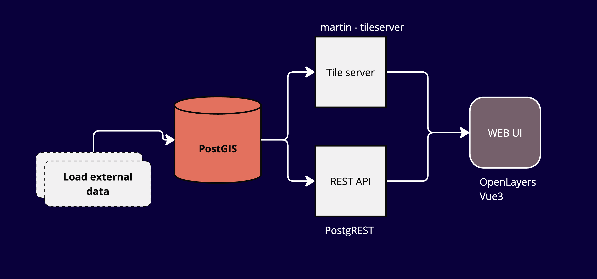

# 🚢 AIS Data Processing & Visualization

---

# 🌟 Overview

- **Database Schema Design**
- **Data sources**
- **Views and Queries**
- **Frontend Integration**
- **Visualization with OpenLayers**

---

## 🛠️ 1. Database Schema Design

### Tables Overview

- **`ships` Table**: Stores ship details like MMSI, IMO, and dimensions.
- **`ais_data` Table**: Holds AIS data with timestamps, positions, speed, and navigation status.
- **`voyage_segments` Table**: Stores segmented voyage data with origin, destination, and `LINESTRING` geometries.

---
# Schema


---

# Schema Details: Ships

```sql
CREATE TABLE ships (
  ship_id SERIAL PRIMARY KEY,
  mmsi VARCHAR(20) UNIQUE NOT NULL,
  imo VARCHAR(20),
  ship_name VARCHAR(100),
  owner VARCHAR(100),
  draught FLOAT,
  size_a FLOAT,
  size_b FLOAT,
  ship_type INTEGER,
  cargo_type INTEGER
);
```

---
# Schema Details: AIS_data (main data table)

```sql
CREATE TABLE ais_data (
  ais_id SERIAL PRIMARY KEY,
  ship_id INTEGER REFERENCES ships(ship_id),
  timestamp TIMESTAMP WITHOUT TIME ZONE,
  lat FLOAT,
  lon FLOAT,
  nav_status INTEGER,
  speed FLOAT,
  course FLOAT,
  heading FLOAT,
  destination VARCHAR(100),
  rot FLOAT,
  eot FLOAT
);
```

---
# Schema Details: Navigation status

```sql
CREATE TABLE nav_status (
	id SERIAL NOT NULL, 
	code VARCHAR, 
	description VARCHAR, 
	PRIMARY KEY (id)
)
```

--- 
# Schema Details: Voyage segements

```sql
CREATE TABLE voyage_segments (
  voyage_id SERIAL NOT NULL,
  ship_id INTEGER NOT NULL REFERENCES ships(ship_id),
  start_dt TIMESTAMP WITHOUT TIME ZONE,
  end_dt TIMESTAMP WITHOUT TIME ZONE,
  origin geometry(POINT, 4326),
  destination geometry(POINT, 4326),
  origin_port VARCHAR,
  destination_port VARCHAR,
  origin_port_distance FLOAT,
  destination_port_distance FLOAT,
  ais_data geometry(LINESTRING, 4326),
  PRIMARY KEY (voyage_id, ship_id)
);
```

---
# Schema Details: Voyage models
```sql
CREATE TABLE voyage_models (
	id SERIAL NOT NULL, 
	comment VARCHAR, 
	script VARCHAR, 
	PRIMARY KEY (id), 
	UNIQUE (comment)
)
```


---

# 🌐 Data Sources

- AIS data (ais2018_chemical_tanker.csv)
- [OSM](https://download.openstreetmap.fr/extracts/)
- [Natural earth](https://www.naturalearthdata.com/downloads/)

#### 😎 OSM data from [openseamaps](https://www.openseamap.org/index.php?id=openseamap&no_cache=1)

---
# Additional data sources

- Metaocean data
- Ship meta data from ships database dowload or API?

---

# Diskspace

### AIS data

Orignal: 4450 MB

table: 2370 MB
index: 884 MB
total: 3254 MB


---

# ✨ Frontend Integration 



---
# ✨ Frontend Integration: tile server vs rest api

- Martin tile server vs PostgREST api


---

# 🗺️ Vector tiles with OpenLayers and Vue3

```js
const martinUrlVoyageSegments = "http://0.0.0.0:8090/long_voyages/{z}/{x}/{y}"

 <ol-vector-tile-layer
  ref="MartinLayer5"
  title="voyages"
  >
    <ol-source-vector-tile :url="martinUrlVoyageSegments" :format="mvtFormat">
    </ol-source-vector-tile>
</ol-vector-tile-layer>

```

---

# 🧩 Views and Queries

- full length: origin port to destination port
- Sailing / when the enginge is on
- estimated missing trajectories
- Multiple resolutions (1min, 5min, 30min, 1hr etc.)
- Get ais_data for each voyage

---

##  Voyage splits based on sailing and nav status

```sql
WITH voyage_data AS (
    SELECT
        ship_id,
        timestamp AS point_time,
        ST_SetSRID(ST_MakePoint(lon, lat), 4326) AS point_geom,
        nav_status,
        LEAD(timestamp) OVER (PARTITION BY ship_id ORDER BY timestamp) AS next_time,
        LEAD(nav_status) OVER (PARTITION BY ship_id ORDER BY timestamp) AS next_status
    FROM
        ais_data
	WHERE speed < 0.3
),
segments AS (
    SELECT
        ship_id,
        point_time AS start_dt,
        next_time AS end_dt,
        point_geom AS origin,
        LEAD(point_geom) OVER (PARTITION BY ship_id ORDER BY point_time) AS destination,
        ST_MakeLine(point_geom, LEAD(point_geom) OVER (PARTITION BY ship_id ORDER BY point_time)) AS ais_data
    FROM
        voyage_data
    WHERE
        nav_status in (1,3) 
        AND next_status not in (1,3)
)
INSERT INTO voyage_segments (ship_id, start_dt, end_dt, origin, destination, ais_data)
SELECT
    ship_id,
    start_dt,
    end_dt,
    origin,
    destination,
    ais_data
FROM
    segments
WHERE
    origin IS NOT NULL
    AND destination IS NOT NULL;

```
---
##  Aggregating AIS Data for Voyages

- Create `LINESTRING` from AIS data points for each voyage.

```sql
UPDATE voyage_segments vs
SET ais_data = COALESCE(
    (SELECT ST_MakeLine(ST_SetSRID(ST_MakePoint(ad.lon, ad.lat), 4326) ORDER BY ad.timestamp)
     FROM ais_data ad
     WHERE ad.ship_id = vs.ship_id
       AND ad.timestamp BETWEEN vs.start_dt AND vs.end_dt),
    ST_MakeLine(ARRAY[
      ST_SetSRID(ST_MakePoint(ST_X(vs.origin), ST_Y(vs.origin)), 4326),
      ST_SetSRID(ST_MakePoint(ST_X(vs.destination), ST_Y(vs.destination)), 4326)
    ])
);
```


---
## Identify ports and distance to port

```sql
WITH nearest_origin_ports AS (
    SELECT 
        v.voyage_id,
        p.name AS origin_port_name,
        ST_Distance(v.origin, p.geometry) AS origin_distance
    FROM 
        voyage_segments v
    LEFT JOIN 
        ne_ports p ON ST_DWithin(v.origin, p.geometry, 10000) -- 10000 meters (10 km) tolerance, adjust as needed
    ORDER BY 
        origin_distance
)
UPDATE voyage_segments v
SET 
    origin_port = nop.origin_port_name,
    origin_port_distance = nop.origin_distance
FROM 
    nearest_origin_ports nop
WHERE 
    v.voyage_id = nop.voyage_id
    AND nop.origin_port_name IS NOT NULL; -- Ensure only rows with a port match are updated
```


---
## filter long voyages

```sql
CREATE OR REPLACE VIEW long_voyages AS
SELECT * FROM public.voyage_segments
WHERE end_dt - start_dt >= INTERVAL '90 days' AND data_point_count > 1000
ORDER BY voyage_id ASC, ship_id ASC 
```

---
# How to connect to the database?


---
# 🎯 Questions

- Commmon DB schema standards? How to agree and update frequently?
- Data sources? Meteorological data? Ocean/weather data? 
- How to share the code?
- More db views and ?
- Front end visualization: ideas to view the data in different ways!


---

#  Thank you for your attention 🐳


