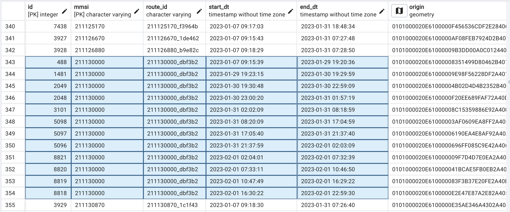

# 🚢 CLEAR Database


---
## Schema V1:  AIS_data 

- Store each raw ais data point as row
- coompute voyages after inserting data into the database.

---
## Schema V1:  AIS_data 

```sql
CREATE TABLE ais_data (
  ais_id SERIAL PRIMARY KEY,
  ship_id INTEGER REFERENCES ships(ship_id),
  timestamp TIMESTAMP WITHOUT TIME ZONE,
  lat FLOAT,
  lon FLOAT,
  nav_status INTEGER,
  speed FLOAT,
  course FLOAT,
  heading FLOAT,
  destination VARCHAR(100),
  rot FLOAT,
  eot FLOAT
);
```

---
## Challenges

- large table size and index size
- Longer query time
- too many rows
- creating trajectories too slow


---
### Schema V2: AIS_data as Trajectories segments

- Store a segment of a trajectory
- 500 or more data points in each row
- LonLat as LINESTRING
- timestamps, heading, speed, course as LISTs
- LISTs are querriable in PostGIS
- assign a **route_id** for each segment to track a full trajectory 

---
### Schema V2: AIS_data as Trajectory segments
<div style="width: 80%; font-size: 24px; margin: auto;"> 

```sql
CREATE TABLE trajectories (
	id SERIAL NOT NULL, 
	mmsi VARCHAR NOT NULL, 
	route_id VARCHAR, 
	start_dt TIMESTAMP WITHOUT TIME ZONE, 
	end_dt TIMESTAMP WITHOUT TIME ZONE, 
	origin geometry(POINT,-1), 
	destination geometry(POINT,-1), 
	count INTEGER, 
	duration INTERVAL, 
	coordinates geometry(LINESTRING,-1), 
	timestamps TIMESTAMP WITHOUT TIME ZONE[], 
	speed_over_ground FLOAT[], 
	navigational_status INTEGER[], 
	course_over_ground FLOAT[], 
	heading FLOAT[], 
	PRIMARY KEY (id, mmsi), 
	CONSTRAINT uix_mmsi_start_dt UNIQUE (mmsi, start_dt)
);
```
</div>


---
## Example trajectory segments


---
## Advantages:
- Number of rows is orders of magnitude smaller
- Smaller table and index size
- Quick query response
- Much easier to create image dataset for clustering

- Automatic identification of missing data 
    - time difference between consecutive data points
    - anomalies timeframe: days, weeks and months
---
## Challenges:
- Takes longer time to process and insert data
- currently sequencial to track the route_id

---
### Thoughts:
- maybe skip tracking route_id
    - instead create complete trajectories seperately a new table?
    - can process in parallel and way faster.
    - not needed for clu anyways
- Is data compression needed?  

---
## Suggestion

```sql
CREATE TABLE IF NOT EXISTS sjfv.segments_2024(rowid bigint ,
    mmsi bigint,
    date1 timestamp with time zone,
    date2 timestamp with time zone,
    segment geometry(LineString,4326),
    cog smallint,
    heading smallint,
    sog double precision,
    route_id bigint,
    state_id bigint
    )
```